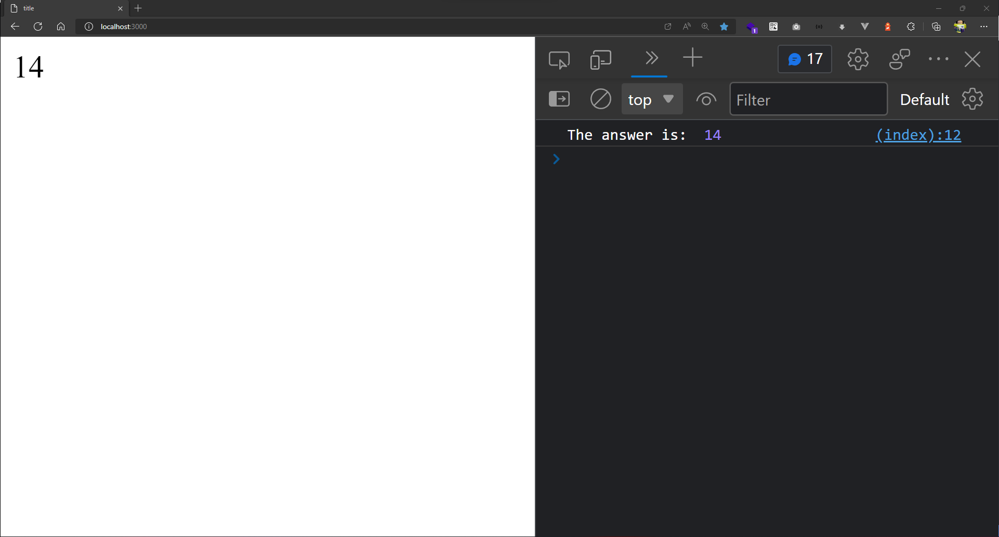

# RUST WASM APP

create app

```sh
cargo new rust-wasm-app --lib
```

add dependencies

```sh
cargo add  wasm-gc   
```

configuration Cargo.toml

```toml
...
# new material
[lib]
crate-type = ["cdylib", "rlib"]
```

compile wasm32

```sh
rustup target add wasm32-unknown-unknown
```

build

```sh
cargo build --target wasm32-unknown-unknown --release 
```

## WebAssembly Specifications

To support the embedding of WebAssembly into different environments, its specification is split into layers that are specified in separate documents.

```sh
wasm-gc target/wasm32-unknown-unknown/release/rust_wasm_app.wasm 
```

run html serve

```sh
npx serve -p 3000 ./
```

## demo


